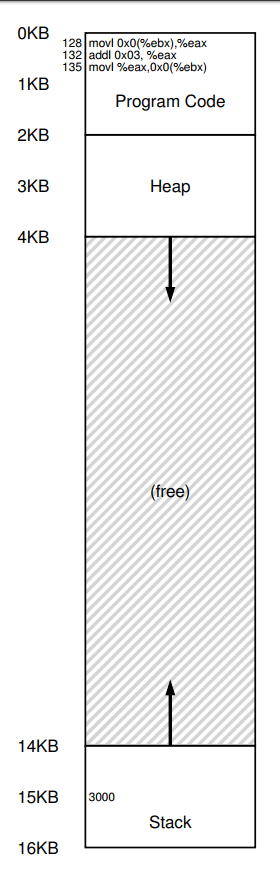
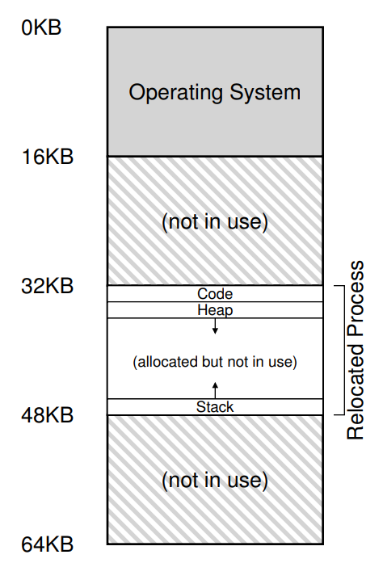
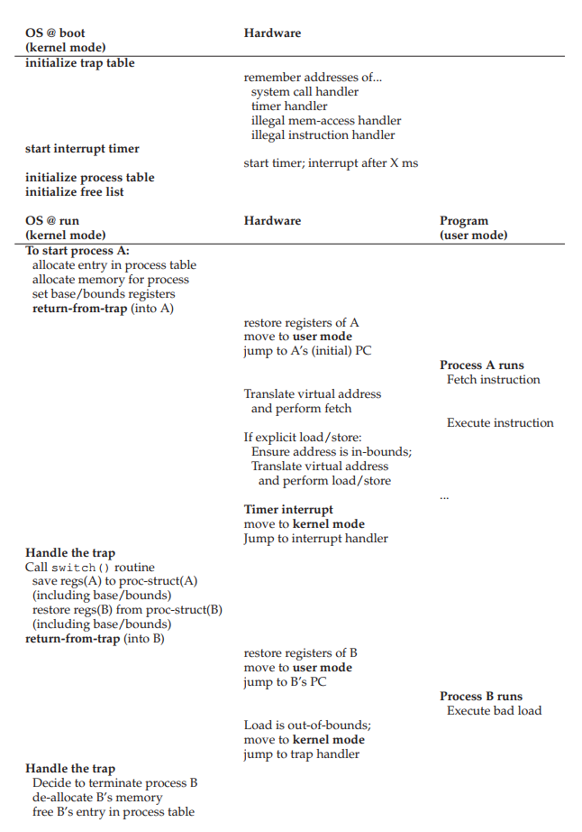

# Address Translation

### Example of virtual to physical address translation

Assumption:
- process size is smaller than physical memory size
- code, heap and stack are all within a continuous memory slot allocated for a process (in reality they are separated)

a piece of C code

```
void func() {
    int x = 3000;
    x = x + 3;
}
```
compiler turns this to assembly
```$xslt
128: movl 0x0(%ebx), %eax ;load 0+ebx into eax
132: addl $0x03, %eax ;add 3 to eax register
135: movl %eax, 0x0(%ebx) ;store eax back to mem
```
Visual representation of program code and processes

process virtual address | process physical address
:------------: | :-------------:
 | 

From the perspective of the process, the following memory accesses take place

* Fetch instruction at address 128
* Execute this instruction (load from address 15 KB)
* Fetch instruction at address 132
* Execute this instruction (no memory reference)
* Fetch the instruction at address 135
* Execute this instruction (store to address 15 KB)

From the perspective of the processor, the following memory accesses take place

* physical address = virtual address + base

Example: Look at instruction at Line 128:

* Base is set to 32Kb

* The program counter (PC) is set to 128; 

* when the processor needs to fetch this instruction, it first adds the value to the base register value
of 32 KB (32768) to get a physical address of 32896;

* the process then issues the load from virtual address 15 KB, 

* the processor takes and again adds to the base register (32 KB), 
getting the final physical address of 47 KB

* Because this relocation of the address happens at runtime, and because we can move address spaces even after the process has started running, the technique is often referred to as dynamic relocation

First, there two different process modes:

1. OS runs in privileged mode (or kernel mode), where it has access to the entire machine
2. Applications run in user mode, limited in what they can do.

**The hardware must provide for OS:**

* base and bounds registration during context switch

    * each CPU thus has an additional pair of registers, part of the memory management unit (MMU) of the CPU. 

* translate virtual to physical address

* check within bound

* instructions to modify the base and bounds registers
    * OS need to change them when different processes run. 
    * These instructions are privileged; only in kernel mode can the registers be modified.

* ability to raise _exceptions_

* register _exceptions_ handlers for preventing applications tries to access memory outside of bound

* register _exceptions_ handlers for preventing applications tries to change base and bound

* inform the location of these handlers; a few more privileged instructions are thus needed

* allocate memory for new processes

* reclaim memory from terminated processes

* manage a list of free memory

