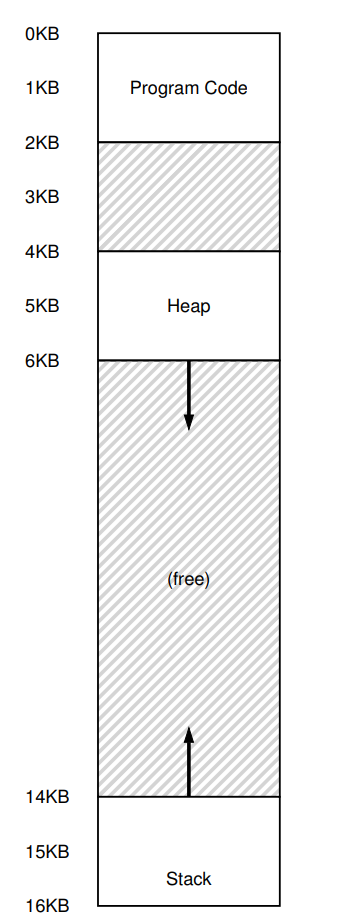
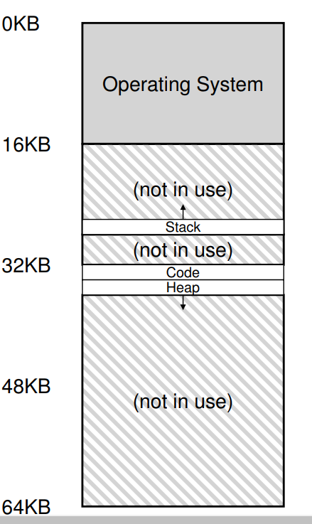
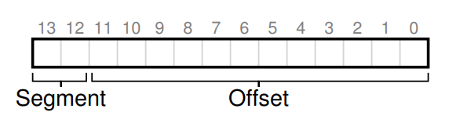
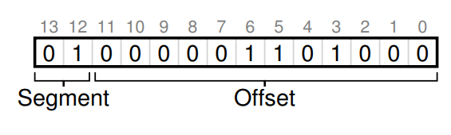
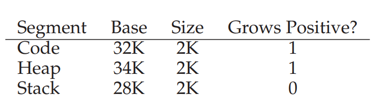

# Segmentation

there is a big chunk of “free” space right in the middle, between the stack
and the heap

the simple approach of using a base and bounds
register pair to virtualize memory is wasteful.

 three logically-different segments: code, stack,
and heap

segmentation allows the OS to do is to place each one
of those segments in different parts of physical memory

i.e.  With a base and bounds pair
     per segment, we can place each segment independently in physical memory
     
process virtual address | process physical address
:------------: | :-------------:
 | 

The hardware structure in our MMU required to support segmentation
is just what you’d expect: in this case, a set of three base and bounds
register pairs

Segment | Base | Bound
--- | --- | ---
Code |32K| 2K
Heap |34K |2K
Stack |28K |2K

Example

```$xslt
128: movl 0x0(%ebx), %eax ;load 0+ebx into eax
132: addl $0x03, %eax ;add 3 to eax register
135: movl %eax, 0x0(%ebx) ;store eax back to mem
```

Code Segment

a reference is made to virtual address 128 (code segment). 

When the reference takes place (say, on an instruction fetch), 
the hardware will add the base value to the offset into this segment (100 in
this case) to arrive at the desired physical address: 128 + 32KB, or 32896.

It will then check that the address is within bounds (100 is less than 2KB),
find that it is, and issue the reference to physical memory address 32896.

Heap Segment

virtual address 4200 

If we just add the virtual address 4200 to the base of the heap (34KB), 
we get a physical address of 39016, which is not the correct physical address. 

What we need to first do is extract the offset into the heap, 
i.e., which byte(s) in this segment the address refers to. 
Because the heap starts at virtual address 4KB (4096), the offset of 4200 is actually
4200 minus 4096, or 104. We then take this offset (104) and add it to the
base register physical address (34K) to get the desired result: 34920

Which Segment Are We Referring To?

An explicit approach,
is to chop up the address space into segments based on the top few bits
of the virtual address

we have three segments; thus we need two
bits to accomplish our task




Let’s take our example heap
virtual address from above (4200) and translate it, just to make sure this
is clear. The virtual address 4200, in binary form, can be seen here

the top two bits (01) tell the hardware
which segment we are referring to. The bottom 12 bits are the offset into
the segment: 0000 0110 1000, or hex 0x068, or 104 in decimal. Thus, the
hardware simply takes the first two bits to determine which segment register
to use, and then takes the next 12 bits as the offset into the segment.
By adding the base register to the offset, the hardware arrives at the fi-
nal physical address

The stack has been relocated to physical address 28KB in the diagram
above, but with one critical difference: it grows backwards. In physical
memory, it starts at 28KB and grows back to 26KB, corresponding to
virtual addresses 16KB to 14KB; translation must proceed differently



we wish to access virtual address 15KB (in the stack), which should map to physical address 27KB. 

Our virtual address, in binary form, thus looks like this: 11 1100 0000 0000 (dec 15360)

(hex 0x3C00, dec 3072).

The hardware uses the top two bits (11) to designate the segment, but then we are left with an offset of 3KB. 

To obtain the correct negative offset, we must
subtract the maximum segment size from 3KB: in this example, a segment
can be 4KB, and thus the correct negative offset is 3KB minus 4KB
which equals -1KB. We simply add the negative offset (-1KB) to the base
(28KB) to arrive at the correct physical address: 27KB. The bounds check
can be calculated by ensuring the absolute value of the negative offset is
less than the segment’s size.

OS support

what should the OS do on a context switch? You should have a good
guess by now: the segment registers must be saved and restored. Clearly,
each process has its own virtual address space, and the OS must make
sure to set up these registers correctly before letting the process run again.
The second, and more important, issue is managing free space in physical
memory. When a new address space is created, the OS has to be
able to find space in physical memory for its segments. Previously, we
assumed that each address space was the same size, and thus physical
memory could be thought of as a bunch of slots where processes would
fit in. Now, we have a number of segments per process, and each segment
might be a different size.

